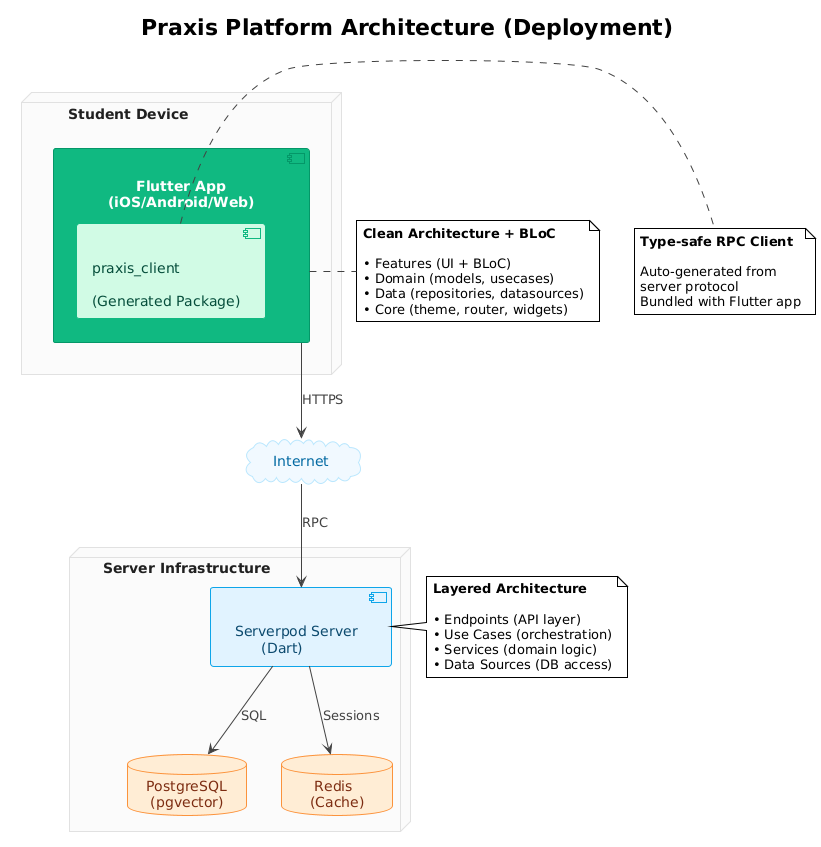

# Praxis Platform

[](https://dart.dev)
[](https://flutter.dev)
[](https://serverpod.dev)

Educational platform for interactive programming courses with AI-powered assistance and progress tracking.

> **Note:** This is an educational project developed for university purposes to gain practical development experience.

**[Quick Start](#quick-start)** • **[Architecture](#architecture)** • **[Development](#development)**

---

**Languages:** [English](#) • [Русский](../docs/ru/README.md)

## Overview

Praxis is a full-stack educational platform consisting of:

- **[praxis-flutter](https://github.com/praxis-plate/praxis-flutter)** – Cross-platform mobile/web application (Flutter)
- **[praxis-api](https://github.com/praxis-plate/praxis-api)** – Backend API server (Serverpod/Dart)

### Key Features

- **Interactive Learning** – courses, modules, lessons with various task types (multiple choice, code completion, matching, text input)
- **Progress Tracking** – lesson completion, statistics, achievements, daily streaks
- **Virtual Wallet** – internal coins and rewards system (no real money integration)
- **AI Assistance** – hint generation and task explanations via LLM integration (optional)
- **Authentication** – email-based identity provider with JWT tokens

## Architecture

The platform follows a **client-server architecture** with clear separation:



*[View UML source](../diagrams/uml/architecture-overview.puml)*

### Technology Stack

- **Frontend:** Flutter 3.38, BLoC pattern, Clean Architecture
- **Backend:** Serverpod 2.x, Dart 3.10
- **Communication:** RPC (Remote Procedure Call) via generated Serverpod client
- **Database:** PostgreSQL (with pgvector)
- **Cache/Sessions:** Redis
- **AI Integration:** Google Gemini API (optional)

**Note:** The Serverpod client is automatically generated from the server's protocol definitions, providing type-safe RPC calls between client and server.

## Quick Start

### Prerequisites

- [FVM](https://fvm.app) (Flutter Version Management)
- [Docker Desktop](https://www.docker.com/products/docker-desktop)
- Dart 3.10+ / Flutter 3.38+ (managed via FVM)

### 1. Clone Repository

```bash
git clone <repository-url>
cd praxis
```

### 2. Start Backend

```bash
cd praxis-api

# Start Postgres + Redis
docker compose up --build --detach

# Install dependencies
fvm dart pub get

# Configure secrets (edit config/passwords.yaml)
# See repository README for details

# Run server
fvm dart run bin/main.dart
```

Server will start on `http://localhost:8080`

### 3. Start Frontend

```bash
cd praxis_flutter

# Install dependencies
fvm flutter pub get

# Configure environment (edit .env)
# See praxis_flutter/README.md for details

# Run app
fvm flutter run
```

## Project Structure

```
praxis/
├── .github/              # Platform documentation
├── praxis_flutter/       # Flutter mobile/web app
│   ├── lib/
│   │   ├── features/     # UI features (auth, courses, lessons, tasks)
│   │   ├── domain/       # Business logic (models, repositories, use cases)
│   │   ├── data/         # Data layer (entities, data sources, repositories)
│   │   └── core/         # Shared utilities (theme, routing, config)
│   └── README.md
├── praxis-api/           # Serverpod backend
│   ├── lib/src/
│   │   ├── endpoints/    # API endpoints
│   │   ├── usecases/     # Business orchestration
│   │   ├── services/     # Domain services
│   │   ├── datasources/  # Database access
│   │   └── models/       # Protocol models
│   ├── config/           # Environment configs
│   ├── migrations/       # Database migrations
│   └── README.md
└── AGENTS.md             # AI assistant guidelines
```

## Development

### FVM Usage

This workspace uses FVM to manage Dart/Flutter SDK versions. Always use FVM commands:

```bash
# Check versions
fvm dart --version
fvm flutter --version

# Install dependencies
fvm dart pub get      # for praxis-api
fvm flutter pub get   # for praxis_flutter
```

### Commit Convention

Use ticket-based commit messages:

```
[TICKET-ID] Brief description in Russian or English

Examples:
[PA-14] Добавил эндпоинт для получения lesson по id
[CDM-23] Поправил детальную страницу
```

For detailed development guidelines, code generation, testing, and deployment instructions, see:
- [praxis-api](https://github.com/praxis-plate/praxis-api) – backend development
- [praxis-flutter](https://github.com/praxis-plate/praxis-flutter) – frontend development
- [AGENTS.md](../AGENTS.md) – AI assistant guidelines

## Documentation

For detailed information about each component, see their respective documentation:

- **Backend:** [praxis-api](https://github.com/praxis-plate/praxis-api)
- **Frontend:** [praxis-flutter](https://github.com/praxis-plate/praxis-flutter)
- **AI Guidelines:** [AGENTS.md](../AGENTS.md)

### External Resources

- [Serverpod Documentation](https://docs.serverpod.dev)
- [Flutter Documentation](https://docs.flutter.dev)
- [Effective Dart](https://dart.dev/guides/language/effective-dart)

## License

This is an educational project developed for university purposes.
